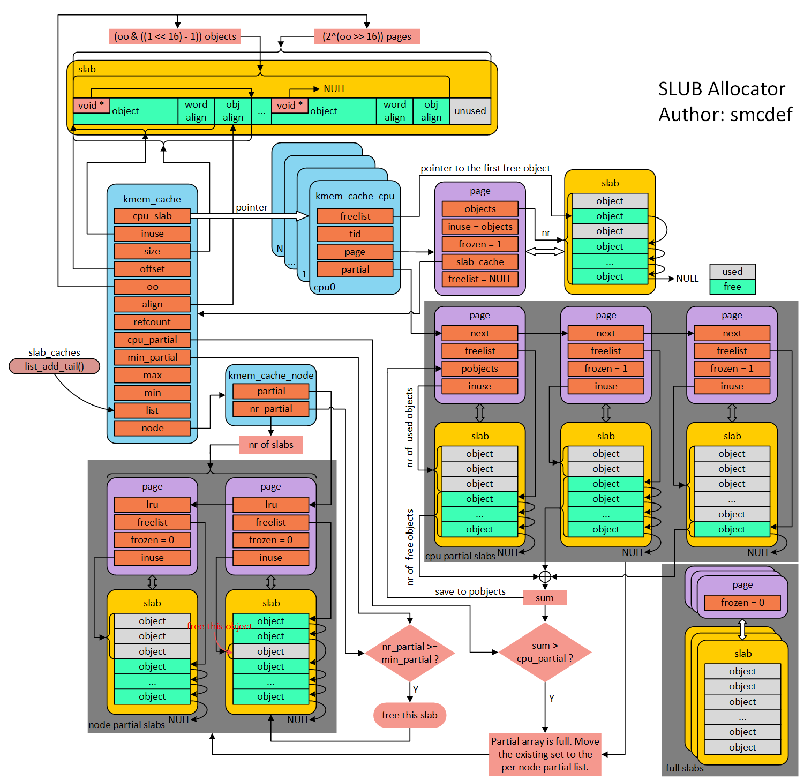

# slab分配器

slab分配算法是Linux中管理堆空间的算法，kmalloc只是slab的一个封装。

slab的基本思想是将整个页面预先切割成若干固定大小的块，每一个块称为object，需要分配时直接返回一个空闲的object，免去普通malloc遍历内存查找符合大小的内存块的过程，因此可以加快分配速度。

## Cache

Cache是slab分配器的最顶层概念。一个Cache中只能包含一种object。比如文件描述符的Cache或进程描述符Cache等。kmalloc将堆空间分为{0,96,192,8,16,32,64,128,256,512,1024,2046,4096,8196}等字节的object，如果内核请求一个10B的空间，kmalloc会返回16B的object。

## Slab

Cache中包含若干个slab，一个slab包含固定的一个或多个页。slab是分配器请求页面的基本单位。当Cache中没有剩余的object时，需要请求新的内存页。请求到的新空白页称为slab，slab在初始化时将空白页内的剩余空间按照object大小进行划分，并将空闲object连接成一个单向链表，slab描述符中持有空闲链表的首地址，从而可以找到所有的空闲块。

slab描述符可以放在slab内部，即这个页的前若干字节。这样对于由分配器分配出去的内存地址，只需要找到这个页的起始地址，就可以找到slab描述符。

## slab和slub

slab和slub是以上描述的分配器的具体实现，slab在Cache中把slab分为full, partial, empty三个队列，而slub只有partial一个队列，slub中不保存满slab和空slab，满slab描述符可以通过地址在页框中找到。空slab会被立即释放。而slab算法中，由内核周期性地遍历空slab列表进行释放。此外，slub还大大地简化了slab描述符的结构。Linux4中已经默认使用slub而不是slab。

